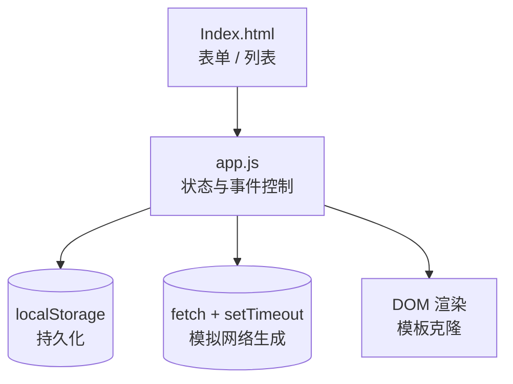

# AI Roast Master 产品报告

## 1. 产品功能介绍
- **毒舌生成**：输入抱怨/场景，点击“Roast Me! (求骂醒)”后模拟 1 秒网络延迟返回随机毒舌，自动加入历史列表。
- **样例加载**：一键加载预置抱怨并匹配随机毒舌，便于快速体验列表与过滤。
- **历史管理**：支持标记“已领悟”、隐藏已领悟、删除单条与清空全部，数据持久化在 localStorage。
- **状态总览**：顶部统计卡实时展示总条数、已领悟、仍需鞭策的数量。

## 2. 程序概要设计
- **入口页面**：`index.html`，包含 UI 结构与语义化模板。
- **样式层**：`styles.css`，延续暗色玻璃拟态主题与响应式布局。
- **逻辑层**：`app.js`，负责状态管理、渲染、事件绑定、网络延迟模拟与存储读写。

## 3. 软件架构图

## 4. 技术亮点及实现原理
- **网络模拟**：通过 `fetch` 请求 + `setTimeout` 施加 1 秒延迟，模拟云端 AI 生成过程，并在按钮与状态文本上呈现 Loading/完成态。
- **随机毒舌库**：预置 `ROAST_LIBRARY`，每次请求随机抽取一句生成，确保结果与输入解耦但体验丰富。
- **本地持久化**：使用 `localStorage` 存储历史，初始化时解析到内存，后续 CRUD 实时写入。
- **组件化渲染**：利用 `<template>` 元素克隆列表卡片，局部更新统计卡与视图，保持交互流畅。
