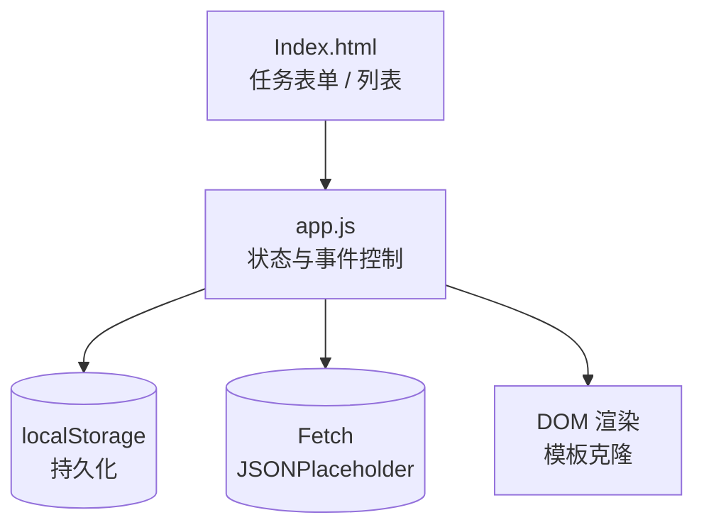

# FocusFlow Mini App 产品报告

## 1. 产品功能介绍
- **待办管理**：快速新增任务，支持补充备注，完成/删除操作。任务即时保存在本地存储，刷新不丢失。
- **云端样例同步**：点击“同步云端样例”通过网络请求获取演示任务，便于体验联网场景。
- **状态总览**：顶部统计卡实时展示总量、已完成、进行中的数量，列表可切换隐藏已完成。
- **数据安全**：提供“一键清空本地”功能，便于演示重置。

## 2. 程序概要设计
- **入口页面**：`index.html`，包含 UI 结构与语义化模板。
- **样式层**：`styles.css`，统一色板、响应式布局、组件化卡片风格。
- **逻辑层**：`app.js`，负责状态管理、渲染、事件绑定、网络与存储读写。

## 3. 软件架构图

## 4. 技术亮点及实现原理
- **本地持久化**：使用 `localStorage` 作为轻量数据库，所有 CRUD 操作后即时写入，初始化时解析到内存状态。
- **网络请求**：通过 `fetch` 调用 `JSONPlaceholder` 演示接口，拉取示例任务并合并到本地数据，展示 loading/错误状态。
- **组件化渲染**：利用 `<template>` 元素克隆任务卡，确保渲染性能稳定；局部更新统计卡保持交互流畅。
- **性能与体验**：无第三方依赖，纯前端实现；限制同步任务数量、复用节点模板，减少重排与内存占用。
